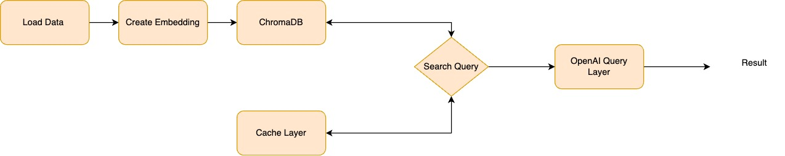

## Search system using RAG for Myntra

Creating a generative search system capable of searching a plethora of product descriptions to find and recommend appropriate choices against a user query. We are using [this Myntra dataset](https://www.kaggle.com/datasets/djagatiya/myntra-fashion-product-dataset) on Kaggle to build such a system.

## Design

Here is the system design block diagram.

We are using the data from Kaggle and uploading it on Google Drive to be further processed.

After reading the data, we are embedding it in the chromaDB vector store. Along with this, we are also using a separate vector store just for the sake of caching similar results so that we don’t need to search in the vector store every time.

Once the data is embedded, we can make the search query and first, we will check the cache if similar results exist, if it does, we will return the result from the cache for further processing.

If data doesn't exist, we will search in the main collection and upon receiving the result, we will cache it and then send it to the next layer.

Finally, we will sort and rank the result and pass it to the OpenAI prompt and get the result from ChatGPT.

## Implementation

We are using Openai, chromaDB, and sentence-transformer library to process the results. We are also using pandas for reading the data frame and processing it. The code is in the notebook file.

